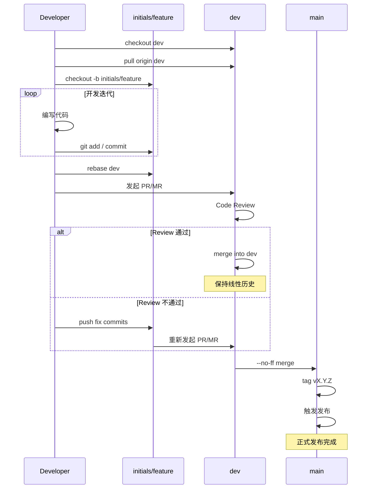
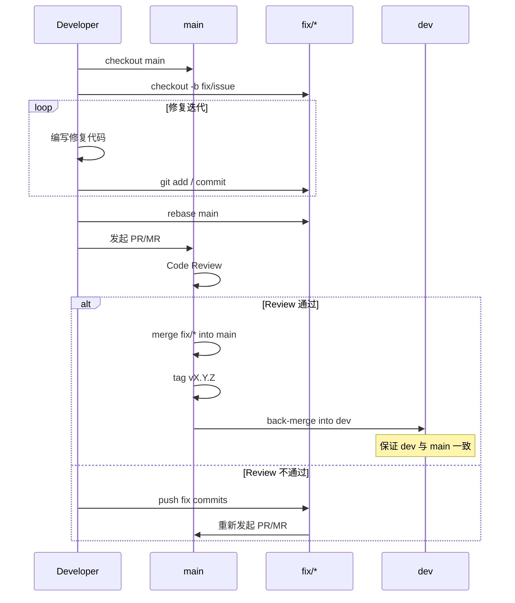

# Git 工作流规范

Git 提交与分支管理规范。

---

## 提交消息

### 格式

```
<type>[(<scope>)]: <subject>
```

- `(scope)` 可选，填写被修改的业务领域名（如 `rule`、`phone`、`sms`、`sched`）
- `chore` 类型通常不带 scope
- subject 用祈使句，不超过 30 字符，首字母小写，末尾无句号
- 字符计数规则：一个汉字、一个字母、一个标点均算 1 个字符

### 语言

subject 的语言跟随用户与 AI 交互所用的语言：

- 用户用中文交互，subject 就用中文描述（如 `feat(ws): 新增 WebSocket 连接管理库`）
- 用户用英文交互，subject 就用英文描述（如 `feat(ws): add websocket manager`）
- 会话中途切换了交互语言，以提交时当前使用的语言为准

`type`、`scope`、结构关键字（如 `BREAKING CHANGE`）保持英文不变，只有描述性文字自适应。

### 类型

| type | 使用场景 |
|------|---------|
| `feat` | 新功能 |
| `fix` | 修复 bug |
| `refactor` | 重构（不改行为） |
| `perf` | 性能优化 |
| `chore` | 文档、构建、CI、工具、依赖 |
| `test` | 测试新增或修改 |

### 示例

```
feat(rule): add clone_from_id to track rule origin
fix(phone): map sopsdk online status to device_status correctly
refactor(rule): remove opts from ListAll to enforce cache hit
refactor(sched): use CancelCauseFunc for card exit reason
chore: upgrade Go to 1.26
test(phone): add onlineStatusToDeviceStatus mapping test
```

### 带 body 的提交

body 解释"为什么"，不解释"做了什么"（diff 已说明）：

```
fix: prevent duplicate order creation on retry

submit handler was not idempotent, allowing the same
request to create multiple orders when the client retried
after a timeout.
```

### 破坏性变更

在 type 后加 `!`（scope 之前），footer 写迁移说明：

```
feat(auth)!: change token payload structure

BREAKING CHANGE: JWT payload field `uid` renamed to `user_id`.
Clients must update token parsing logic.
```

---

## 提交粒度

- 一个 commit 只做一件事，不混改
- 不在同一个 commit 中混合 refactor 和 feat
- 不提交半成品代码（用 `git stash`）
- feature 分支上可以频繁提交，合并前按需 squash

---

## 分支策略

| 分支 | 用途 | 生命周期 |
|------|------|---------|
| `main` | 发布分支，保持稳定可部署 | 永久 |
| `dev` | 开发主线，所有功能在此汇聚 | 永久 |
| `fix/<name>` | 紧急修复，从 `main` 创建 | 合并后删除 |
| `<initials>/<feature>` | 个人开发分支（多人协作时） | 合并后删除 |

### 工作流

#### 日常开发与发布



#### 热修流程



- **个人分支**从 `dev` 创建，命名 `<开发者缩写>/<功能>`：`zs/jwt-refresh`、`lw/user-avatar`
- **合并到 dev**：先 `git rebase dev` 再合并，保持线性历史
- **dev 合并到 main**：`git merge --no-ff dev`，保留合并节点便于追溯版本
- **fix 分支**从 `main` 创建，修完后合并回 `main` 和 `dev`
- **其它个人开发分支禁止直接合并到 `main`**，必须先合入 `dev`
- 分支名用 kebab-case，不用驼峰

---

## 代码审查

合并前对照检查：

- ⚠️ 配置变更是否向后兼容（新增字段可选、默认值合理）
- 🔒 是否引入敏感信息泄露（日志/响应/错误）
- ⏱️ 是否存在超时缺失（HTTP/DB/Redis/外部请求）
- 📦 是否存在无界资源使用（未限制 body、未限制上传大小）

---

## 合并条件

### 合并到 `dev`

- `go build ./...` 编译通过
- `go test ./...` 通过
- 无新增 lint 告警
- 关键配置变更已同步更新配置示例与文档

### 合并到 `main`

- 必须来自 `dev`（正常发布）或 `fix/*`（紧急修复）
- 必须先通过 `dev` 分支的合并条件（hotfix 除外，但 hotfix 需单独通过等价检查）
- 合并后立即打 tag `v<major>.<minor>.<patch>`

---

## 版本号

项目使用 Git tag 管理版本，格式 `v<major>.<minor>.<patch>`。

---

## Changelog 生成

基于 Conventional Commits 格式，使用 git log 按 type 分组生成变更日志。

### 生成命令

```bash
# 生成从上一个 tag 到当前的 changelog
git log $(git describe --tags --abbrev=0)..HEAD --pretty=format:"%s" | sort
```

### Changelog 格式

```markdown
## v1.2.0 (2026-07-11)

### feat
- add JWT refresh token support
- add batch export for orders

### fix
- prevent duplicate order creation on retry
- correct timezone in date filter

### refactor
- extract db migration logic into version package

### perf
- optimize list query with covering index
```

### 规则

- 每次 `dev` 合并到 `main` 并打 tag 后生成
- 按 type 分组，每组内按字母排序
- 不记录 `chore` 和 `test` 类型（不影响用户可见行为）
- 破坏性变更单独列在最前，标注 `BREAKING CHANGE`

---

## 提交前检查

- 代码编译通过
- 无新增 lint 告警
- 相关测试通过
- 不提交 `.env`、凭证等敏感文件
